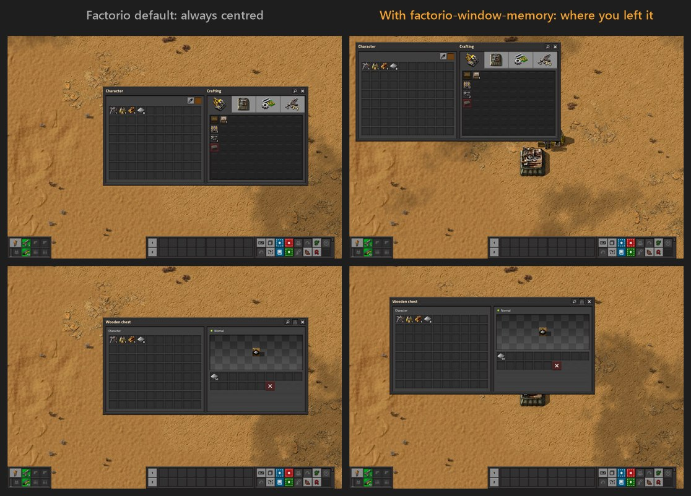

# factorio-window-memory

[](https://github.com/StevenNaliwajka/factorio-window-memory/releases/latest)
[](https://github.com/StevenNaliwajka/factorio-window-memory/releases)
[](#install)
[](#install)
[](https://github.com/StevenNaliwajka/factorio-window-memory/actions/workflows/ci.yml)
[](LICENSE)

Makes Factorio's built-in windows (inventory, chests, machines, production
stats, ...) open where you last dragged them instead of always centred. Each
kind of window remembers its own spot, across restarts.

**[⬇ Download the latest release](https://github.com/StevenNaliwajka/factorio-window-memory/releases/latest)**,
double-click `fwm-launch.exe`, choose **Yes**, and start Factorio from Steam.



Factorio doesn't remember window positions, and its Lua mod API can't move
built-in windows, so this is a native plugin: a small launcher starts the game
and injects a DLL that hooks the game's own window-centring code.

Windows, Steam build of Factorio 2.0 (tested on 2.0.77 + Space Age).

> This is an unofficial fan project, not affiliated with or endorsed by Wube
> Software. "Factorio" is a trademark of Wube Software Ltd.

## Install

Requires 64-bit Windows 10 or 11 and Factorio 2.0 from Steam. Nothing else
needs installing.

It's set and forget: turn it on once, then start Factorio from Steam as usual.

1. Download the latest `factorio-window-memory-*-windows-x64.zip` from
   [Releases](https://github.com/StevenNaliwajka/factorio-window-memory/releases)
   and extract it to a folder you'll keep, for example
   `C:\Tools\factorio-window-memory`. Keep `fwm-launch.exe` and `fwm_hook.dll`
   together.
2. Double-click `fwm-launch.exe` and choose **Yes** to turn it on.
3. Start Factorio from Steam as usual.

Turning it on sets Factorio's Steam launch option to
`"<folder>\fwm-launch.exe" %command%`, keeping any options you already had.
Steam only saves launch options when it exits, so if Steam is open it closes and
reopens. It won't do this while a game is running. The original Steam config is
kept as `localconfig.vdf.fwm-backup` next to it.

**To turn it off**, double-click `fwm-launch.exe` again and choose **Yes**. The
launch option goes back to what it was, and Factorio starts normally. To remove
it completely, turn it off, then delete the folder and
`%APPDATA%\Factorio\window-memory`.

If you move the folder, double-click `fwm-launch.exe` in its new place to turn
it on there. You can also set the launch option by hand in Steam (Factorio →
Properties → General → Launch options).

The release isn't code-signed, so Windows may treat the download as untrusted.
Before extracting, right-click the zip → Properties → tick **Unblock**. If
SmartScreen still warns about an unrecognized app, choose **More info → Run
anyway**. The release page lists SHA-256 checksums if you want to verify the
download.

To check it's working, look at `%APPDATA%\Factorio\window-memory\fwm.log`
after starting the game; it should say `hooks installed`.

To build from source instead (see [CONTRIBUTING.md](CONTRIBUTING.md) for the
toolchain), run this; it also turns the plugin on:

```powershell
.\install.ps1                                         # %LOCALAPPDATA%\Programs\factorio-window-memory
.\install.ps1 -Destination C:\Tools\factorio-window-memory
.\install.ps1 -SkipSteam                              # copy only, leave Steam alone
```

All commands:

| Command | Does |
| --- | --- |
| `fwm-launch.exe` | asks to turn the plugin on, or off if it's on |
| `fwm-launch.exe --install` / `--uninstall` | turns it on / off without asking |
| `fwm-launch.exe --launch` | starts Factorio with the plugin once, without changing Steam |
| `fwm-launch.exe --attach` | loads the plugin into a game that's already running |
| `fwm-launch.exe --help` | all options |

## Use

Drag any window by its title bar. The next time that kind of window opens, it
opens there. Positions are kept per window type and survive restarts.

Positions live in `%APPDATA%\Factorio\window-memory\positions.json`:

```json
{
  "version": 1,
  "windows": { "ControllerGui": { "x": 20, "y": 20 } },
  "ignore": ["FurnaceGui"]
}
```

- To reset a window, drag it back, or delete its entry while the game is closed.
- Window types listed under `ignore` always open where Factorio puts them.
- A saved spot that would put a window off screen (after a resolution change,
  say) is pulled back so the whole window is visible.

Window types seen so far: `ControllerGui` (inventory/crafting), `ContainerGui`
(chests), `AssemblingMachineSelectRecipeGui`, `FurnaceGui`, `ProductionGui`,
`MainMenuGui`, `NoticeBox`. Plain `agui::Window` dialogs are never moved,
because that one type covers many unrelated dialogs.

## How it works

- Factorio ships `factorio.pdb`, its debug symbols. At startup the DLL reads
  it, checks that its GUID matches the running `factorio.exe`, and looks the
  functions up by name, so game patches only break this if Wube renames them.
  If anything doesn't match, nothing is patched and the game runs normally.
- `agui::Window::center()` is detoured: the game centres the window as usual,
  then the plugin moves it to the saved spot for that window's C++ class (read
  from MSVC RTTI), clamped to the game window.
- The drag handlers of windows and their title bars (`Window`, `Label`,
  `Layout`, `EmptyWidget` `::mouseDrag`) are detoured to record where windows end
  up. Functions the linker folded together with other code are never patched.
  `Widget::mouseDrag` is skipped for that reason, since it shares code with
  `Widget::mouseMove`.
- Positions are written within half a second of a drag.
- The launcher starts the game suspended, injects the DLL with
  `CreateRemoteThread(LoadLibraryW)`, calls its `fwm_init` export, then resumes
  the game. If early injection fails it retries once the game is running. When
  started outside Steam it sets `SteamAppId`, as Steam does. Without it the Steam
  build exits at once and asks Steam to relaunch it, without the plugin.

Logs: `fwm.log` (plugin) and `fwm-launch.log` (launcher), next to `positions.json`.

## Tests

```powershell
.\test.ps1           # everything, including two runs of the real game
.\test.ps1 -NoGame   # skip the in-game test
```

- **Unit tests:** geometry/clamping, the position store, RTTI names, PE CodeView
  parsing, launcher arguments and command-line quoting, Steam library parsing.
- **Installed-game check:** the installed `factorio.pdb` still has every function,
  none of the required hooks is folded, and its GUID/age match `factorio.exe`.
- **Injection:** the real DLL is injected into a stand-in process, both at startup
  and after it's running, and its error comes back through the launcher.
- **Steam switch:** `--install` and `--uninstall` run against a fake Steam folder,
  and turning off must restore the config exactly. A read-only check confirms
  this PC's real `localconfig.vdf` files are reproduced byte for byte by the
  editor.
- **End-to-end** (`e2e\run-e2e.ps1`): runs the real game twice in an isolated data
  folder under `target\e2e`. It has its own config, saves and mods, audio off, and
  an unfocused window. A test mod opens the inventory, chest, assembler, furnace
  and production windows.
  - Run 1 drags the inventory by its title bar using posted mouse messages, then
    checks that the drag was saved and the window reopens there.
  - Run 2 restarts with a saved spot for every window type and checks each one
    opens there.
  - Screenshots of every step are saved in `target\e2e\run1` and `run2`.

## Caveats

- **Unofficial:** Wube doesn't support this. Don't send them crash reports from a
  game with it loaded.
- **Steam build only:** needs `factorio.pdb`, which ships with the Windows Steam
  build.
- **Client-side only:** it only moves your own windows and never touches game
  state, so it shouldn't affect multiplayer.
- **Antivirus:** some tools flag DLL injectors on principle.

## Layout

| Path | What |
| --- | --- |
| `crates/fwm-core` | symbol lookup, PE/PDB matching, RTTI names, clamping, positions.json, launcher args |
| `crates/fwm-hook` | the injected DLL: hooks, RTTI reading, logging |
| `crates/fwm-launch` | the launcher/injector (+ `fwm-dummy`, the injection-test target) |
| `e2e/` | end-to-end test script and its Factorio test mod |
| `docs/images/` | README screenshots (taken by the end-to-end test) and the repo's social-preview card |

## Contributing

Bug reports and pull requests are welcome; see [CONTRIBUTING.md](CONTRIBUTING.md).
Please report security issues privately as described in [SECURITY.md](SECURITY.md).

## License

[MIT](LICENSE)
